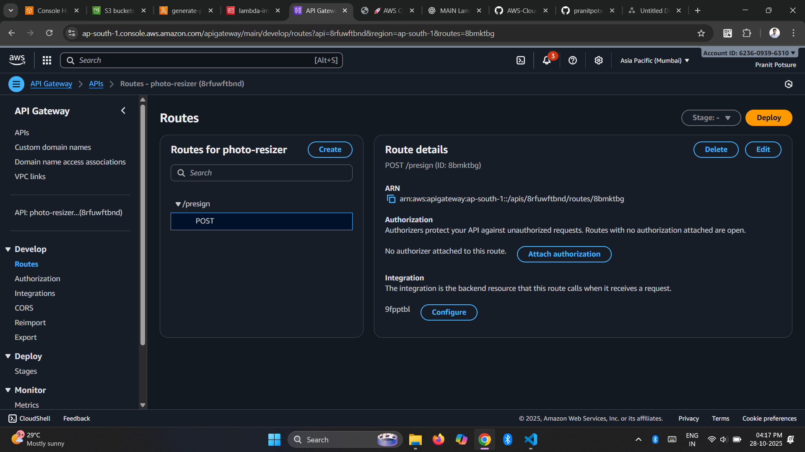
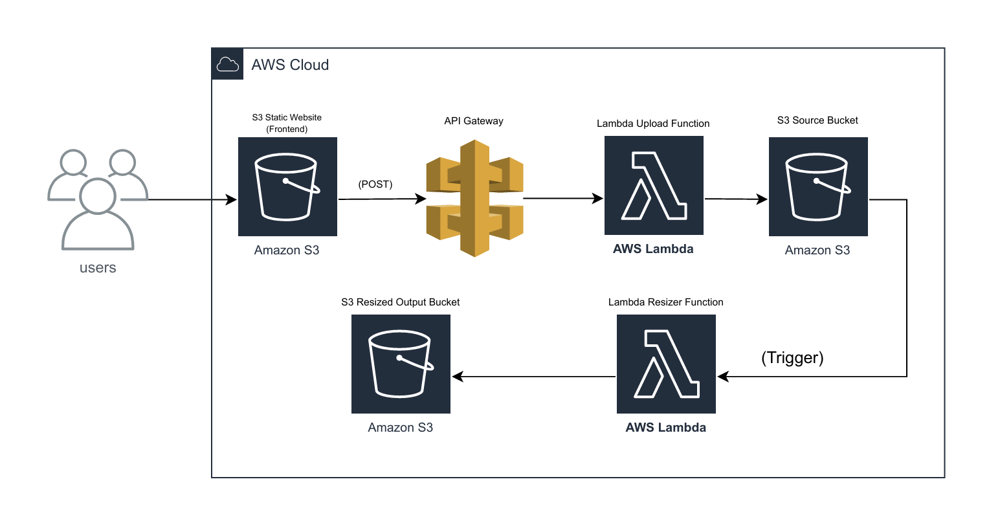

# ☁️ AWS Cloud Image Uploader & Resizer

> **A fully serverless cloud project built with AWS Lambda, S3, and API Gateway — featuring automatic image resizing and a modern static upload portal.**

---

## 🏗️ Architecture Overview
```
[User Browser]
↓
[S3 Static Website (Frontend)]
↓ (POST)
[API Gateway]
↓
[Lambda Upload Function]
↓
[S3 Source Bucket]
↓ (Trigger)
[Lambda Resizer Function]
↓
[S3 Resized Output Bucket]
```

---

## 🧠 About the Project

| Feature | Description |
|----------|--------------|
| 🌐 **Frontend** | Static web app hosted on Amazon S3 |
| ⚙️ **Backend** | Serverless APIs via AWS Lambda + API Gateway |
| 🖼️ **Automation** | Image resizing via S3 event trigger |
| ☁️ **Storage** | Two S3 buckets – source and resized |
| 🔒 **Security** | IAM roles with least-privilege access |
| 🧩 **Architecture Type** | Fully serverless, scalable, and event-driven |

---

## 🪄 Tech Stack & Tools


---

## 📂 Folder Structure
```
aws-image-uploader/
│
├── frontend/
│ ├── index.html
│ ├── style.css
│ └── script.js
│
├── backend/
│ ├── generate-presign.py
│ └── lambda_resizer.py
│
└── README.md
```
---

## 🔧 Setup Guide (From Scratch)

### 🪣 1. Create Two S3 Buckets
| Bucket Name | Purpose |
|--------------|----------|
| `pranit-image-upload-source` | Stores uploaded original images |
| `pranit-image-upload-output-20251027` | Stores resized images |

➡️ Enable **Static Website Hosting** for your frontend bucket.

---

### 🔐 2. Create IAM Role for Lambda

Attach the following **least-privilege policy**:
```json
{
  "Version": "2012-10-17",
  "Statement": [
    {
      "Sid": "S3Access",
      "Effect": "Allow",
      "Action": ["s3:GetObject", "s3:PutObject"],
      "Resource": [
        "arn:aws:s3:::pranit-image-upload-source/*",
        "arn:aws:s3:::pranit-image-upload-output-20251027/*"
      ]
    }
  ]
}
```
---
### ⚙️ 3. Lambda Function – Upload to S3 (Presigned URL)
Filename: generate-presign.py
```
import json
import boto3

s3 = boto3.client('s3')
BUCKET_NAME = "pranit-image-upload-source"

def lambda_handler(event, context):
    print("EVENT:", event)

    try:
        body = json.loads(event.get("body", "{}"))
        filename = body.get("filename")
        content_type = body.get("content_type")

        if not filename:
            return {"statusCode": 400, "body": json.dumps({"error": "filename required"})}

        # ✅ Generate presigned URL (PUT method)
        presigned_url = s3.generate_presigned_url(
            "put_object",
            Params={
                "Bucket": BUCKET_NAME,
                "Key": filename,
                "ContentType": content_type,
            },
            ExpiresIn=300
        )

        return {
            "statusCode": 200,
            "headers": {
                "Access-Control-Allow-Origin": "https://pranit-image-web.s3.ap-south-1.amazonaws.com",
                "Access-Control-Allow-Methods": "POST, OPTIONS",
                "Access-Control-Allow-Headers": "Content-Type"
            },
            "body": json.dumps({
                "upload_url": presigned_url,
                "key": filename
            })
        }

    except Exception as e:
        print("Error:", e)
        return {
            "statusCode": 500,
            "headers": {
                "Access-Control-Allow-Origin": "https://pranit-image-web.s3.ap-south-1.amazonaws.com"
            },
            "body": json.dumps({"error": str(e)})
        }
```

---
### 🌐 4. API Gateway Setup (HTTP API)
Setting	Value
Type	HTTP API (lightweight, cost-effective)
Integration	Lambda (image-presign-lambda)
Route	POST /presign
Stage	prod

CORS Settings

Allow origins → https://pranit-image-web.s3.ap-south-1.amazonaws.com

Allow methods → OPTIONS, POST

Allow headers → Content-Type

Allow credentials → ❌ Disabled

Deploy URL:```https://8rfuwftbnd.execute-api.ap-south-1.amazonaws.com```

Test Command:```
curl -X POST https://8rfuwftbnd.execute-api.ap-south-1.amazonaws.com/presign \
  -H "Content-Type: application/json" \
  -d '{"filename":"test.jpg","content_type":"image/jpeg"}'```

✅ Returns presigned S3 upload URL.

---
### 🖼️ 5. Lambda Function – Image Resizer
Filename: lambda_resizer.py
```
import boto3
from PIL import Image
import io
import os

s3 = boto3.client('s3')

def lambda_handler(event, context):
    source_bucket = event['Records'][0]['s3']['bucket']['name']
    source_key = event['Records'][0]['s3']['object']['key']

    target_bucket = os.environ.get('TARGET_BUCKET', 'pranit-image-upload-output-20251027')

    response = s3.get_object(Bucket=source_bucket, Key=source_key)
    image = Image.open(response['Body'])

    image = image.resize((300, 300))

    if image.mode == 'RGBA':
        image = image.convert('RGB')

    buffer = io.BytesIO()
    image.save(buffer, 'JPEG')
    buffer.seek(0)

    output_key = f"resized/{os.path.splitext(source_key)[0]}.jpg"
    s3.put_object(Bucket=target_bucket, Key=output_key, Body=buffer, ContentType='image/jpeg')

    return {
        'statusCode': 200,
        'body': f"✅ Image resized and uploaded to {target_bucket}/{output_key}"
    }
```
🪄 Trigger Setup
```
S3 → pranit-image-upload-source → Properties → Event notifications → Add trigger
Event type: All object create events
Destination: Lambda function → lambda_resizer
```
---
### 💻 6. Frontend Setup
🧠 Overview
A static website hosted on Amazon S3 providing a modern, secure upload interface.
It communicates with API Gateway → Lambda → S3 to upload and resize images automatically.

⚙️ Frontend Flow
User selects an image from the file picker.
Frontend sends a POST request to API Gateway (/presign).
Lambda generates a presigned S3 URL.
Browser performs a PUT request to S3 using that URL.
Image uploads securely — no credentials exposed.
Success message + S3 image link displayed.

🧩 Update Your Script
```const apiUrl = "https://8rfuwftbnd.execute-api.ap-south-1.amazonaws.com/prod/presign";```

---

### 🌐 Host the Frontend
1.Open S3 → Select pranit-image-web bucket.
2.Enable Static Website Hosting under Properties.
 Upload:
  index.html
  style.css
  script.js
  any assets/icons
4.Ensure objects are publicly readable.
5.Open your static site:
```https://pranit-image-web.s3.ap-south-1.amazonaws.com/index.html```

---
### 🌈 User Flow
1.Open the static upload portal.
2.Select or drag-drop an image.
3.Click Upload → Image goes via API Gateway → Lambda → S3.
4.S3 triggers the Resizer Lambda.
5.Resized image saved in pranit-image-upload-output-20251027.
6.View both versions via public S3 URLs.

---
### 🧩 Architecture Highlights (YAML)
```
Copy code
- layer: Frontend
  service: S3 Static Website
  function: File upload interface

- layer: API
  service: API Gateway
  function: Routes requests

- layer: Compute
  service: AWS Lambda
  function: Upload + Resize logic

- layer: Storage
  service: S3 Buckets
  function: Store images

- layer: Monitoring
  service: CloudWatch
  function: Logs + metrics

- layer: Security
  service: IAM
  function: Role-based access
```
---
### 💡 Key Learnings

- 🏗️ Designed and deployed a **serverless image pipeline**  
- ⚙️ Built REST APIs using **Lambda + API Gateway**  
- 🔄 Implemented **event-driven automation** via S3 triggers  
- 🔒 Learned **IAM least-privilege security**  
- 🎨 Designed a **modern AWS-branded web interface**


---

### 🧠 Future Enhancements
- Add CloudFront CDN for faster global access
- Support image format conversion (PNG/JPEG)
- Add upload progress bar + preview
- Store image metadata in DynamoDB

---

### ✨ Author
👨‍💻 Pranit Potsure
AWS • Cloud • DevOps Enthusiast
📫 GitHub Profile
🌐 AWS Cloud Portfolio 🚀

---

### 📸 Project Screenshots

| Step | Description | Preview |
|------|--------------|----------|
| 1️⃣ | **All S3 Buckets** |  |
| 2️⃣ | **IAM Policies Setup** |  |
| 3️⃣ | **Lambda – Image Upload Function** |  |
| 4️⃣ | **Lambda – Image Resizer Function** |  |
| 5️⃣ | **API Gateway Configuration** |  |
| 6️⃣ | **Static Frontend Website** |  |
| 7️⃣ | **Uploaded Image in Source Bucket** |  |
| 8️⃣ | **Resized Image in Output Bucket** |  |
| 9️⃣ | **Frontend Success Upload Message** |  |
| 🔟 | **Full Workflow Example** |  |
